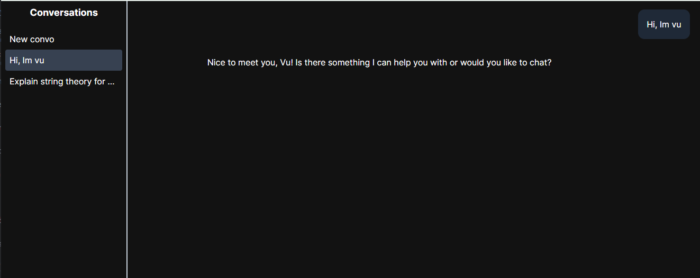

# AI RAG
trying to run Ollama locally for RAG purposes. Interact with the model using rest API (WIP)



## Test API
```bash
cd llm-service
pip install -r requirements.txt
```
```bash
uvicorn llm:app --reload
```

Go to [http://127.0.0.1:8000/docs](http://127.0.0.1:8000/docs)